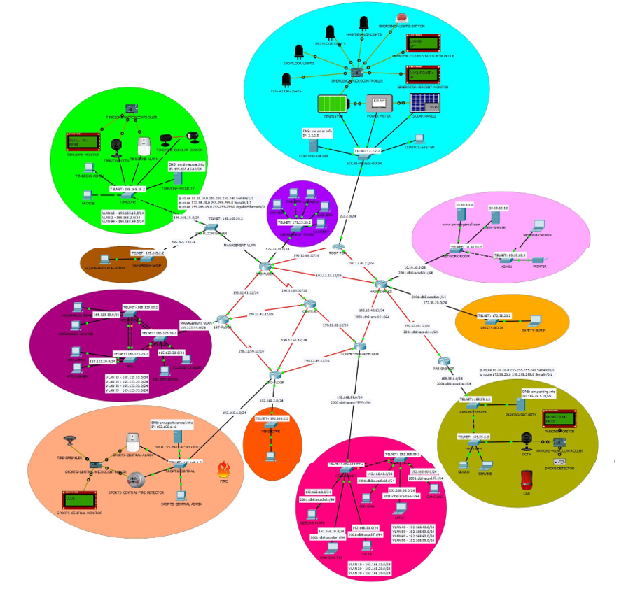

# IoT-Based_SM-Megamall_Packet-Tracer_Project
A network design project built with cisco packet-tracer that was presented during my college days.

## Topology

## Built-with
1. Cisco Packet Tracer
1. Python

## Contributors
1. Luis Daniel Pambid
2. Lance Vincent Pascual

## References
* For the documentation, you can further check [SM-MEGAMALL-DOCU.docx](./SM-MEGAMALL-DOCU.docx)
* For the presentation, you can further check [SM-MEGAMALL-PPT.pptx](./SM-MEGAMALL-PPT.pptx)

## Tip
**If you like our hard work, I would appreciate it if you could buy some coffee for us.**

